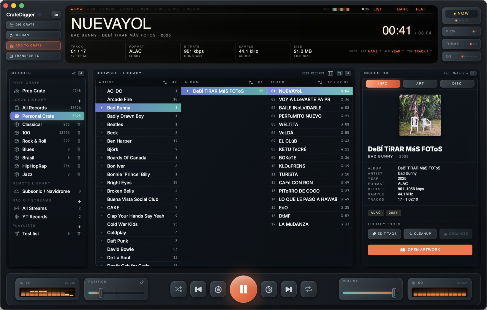

# CrateDigger

A music-library workbench for macOS, for people who still keep their music as
files. I got tired of juggling five different tools to rip, tag, convert and
organize my collection, so I built one that does the whole job. Then I made it
look like the hardware I wish I owned. It's not there yet, but if this project
picks up and people actually use it, I'll hire a talented designer to work on
the skeumorphic tool we all ~don't~ need.


<p align="center">
  
</p>

The whole interface is a bit like a hardware console (the design system is called
Carbon, I mean, why not?): chassis panels, an OLED display, VU meters, faders, knobs, buttons
that light up when you hover. Light and dark, your pick. No cloud, no
accounts, no database lock-in, your files your rules.

## What it does

**Library.** Hit *Dig Crate*, point it at a folder, and it scans everything in
it, however deep. Browse by Artist → Album → Track with cover art and artwork folder. 
Collections are saved as *crates*, plain JSON files, so nothing is held hostage. Newly
dug music lands in a staging *Prep Crate* (which is like an Inbox)
first so your sorted crates stay clean, you can also use it to just listen to some gibbershily named file
or to convert one track that you need for editing (or whatever).
Or skip all of that and just drop files and folders onto the window.

**Playback.** Queue, shuffle, repeat, ±8s nudge, output-device picker, a real
12-band EQ (20 Hz–20 kHz) and a live spectrum on the VU meters. There's a mini
player for when you just want to play music while you do other stuff.

**Artwork** This is one of my favorite parts of the app, display album artwork nice and big
on the screen, listening to music whilst looking at the albums artwork was one of my favorite
things in the world back when I was a kid. So why can't we enjoy it now? (Btw, props to
all people uploading scans and keeping archive of such vast library, and also new artists
still releasing new physical records! Cheers!)

**Tags & artwork.** Inspect and edit metadata track by track, fix embedded
artwork, pull missing covers, and keep album booklets and scans together with
the music.

**Cleanup & conversion.** (THIS IS A BETA FEATURE, PLEASE USE IT WITH CAUTION)
Move or consolidate the whole library, straighten
out messy folder layouts, and batch-convert with FFmpeg: codec, bitrate,
sample rate, artwork handling, and the output folder structure (mirror the
source tree, flat, or built from metadata). Filename collisions are handled
for you.

**Vinyl rips.** The Record Divider takes one long recording of a record side,
finds the silences between songs, and cuts it into per-track files. You can name these tracks,
but honestly what's the fun in that? Just look at the artwork and you'll see which is track 1 and 5 ;)
Detection sensitivity is a slider, so quiet passages don't get a song chopped in half.
It's a hit and miss thing, I think it's fun, let me know if it's frustrating.

**Radio.** Paste a YouTube URL and treat it like a tuner — live stations, full
sets, mixes and playlists, straight through the same transport and meters.
(Needs yt-dlp, see requirements.)

**More sources.** Rip audio CDs. Browse and stream a Subsonic / Navidrome
server. M3U playlists.

**Devices.** Copy music onto anything that mounts as a drive — USB players, SD
cards — with per-device profiles and one shortcut (⌘⇧T).

**Scrobbling.** Last.fm, if that's your thing.

## Requirements

- **macOS 13 (Ventura) or later.**
- **Apple Silicon** for the default build. (Intel/universal builds are possible
  but need a universal Swift build and a `lipo`-merged universal FFmpeg — see
  below.)
- The packaged app **bundles `ffmpeg` and `ffprobe`**, so there's nothing extra
  to install. When building from source, FFmpeg is optional: without it the app
  falls back to AVFoundation-only metadata and conversion is disabled.
- YouTube radio needs [yt-dlp](https://github.com/yt-dlp/yt-dlp)
  (`brew install yt-dlp`). Everything else works fine without it.

## Install

Grab the latest signed `.dmg` from the
[Releases](https://github.com/mrbarkan/cratedigger/releases) page and drag
CrateDigger to Applications. Now at the 1.0.1 release.

Or build it yourself (below).

If CrateDigger is useful to you, you can chip in on
[Patreon](https://www.patreon.com/mrbarkan) or
[GitHub Sponsors](https://github.com/sponsors/mrbarkan). 💛

## Building from source

Build the app executable:

```bash
swift build
```

Run the test suite:

```bash
scripts/test.sh
```

`scripts/test.sh` forces the XCTest runner path, prefers a full Xcode developer
directory when one is installed, and prints clear guidance if Xcode still needs
its license accepted.

## Packaging

Assemble a shareable `.app` bundle with bundled `ffmpeg` and `ffprobe`:

```bash
scripts/package-app.sh
```

You can also point the script at specific binaries:

```bash
scripts/package-app.sh --ffmpeg /opt/homebrew/bin/ffmpeg --ffprobe /opt/homebrew/bin/ffprobe --output ./dist
```

> **For distribution, do NOT bundle Homebrew's ffmpeg.** Homebrew builds are
> *dynamically* linked to `/opt/homebrew/Cellar/...` dylibs that don't exist on
> other Macs, so conversion / ffprobe fail anywhere without Homebrew ffmpeg
> installed. Bundle **statically-linked** binaries instead — for Apple Silicon,
> the static arm64 `ffmpeg`/`ffprobe` from [osxexperts.net](https://www.osxexperts.net)
> are fully self-contained (verify the published SHA256). Homebrew is fine for
> local dev only. (Intel/universal distribution additionally needs a universal
> Swift build + a `lipo`-merged universal ffmpeg.)

The packaged app is written to `dist/CrateDigger.app`. By default the bundle is
ad-hoc signed (suitable for local development only). The packaging script also
prefers a full Xcode developer directory when one is installed and uses a
repo-local module cache so the build is less sensitive to machine-wide Swift
cache state.

### Distribution build (Developer ID + notarized DMG)

A shippable build needs Developer ID signing, hardened runtime, notarization, and a DMG:

```bash
# One-time: store an app-specific password under a notarytool profile name
xcrun notarytool store-credentials cratedigger-notary \
  --apple-id <your-apple-id> --team-id <TEAMID> --password <app-specific-password>

# Each release
CRATEDIGGER_NOTARY_PROFILE=cratedigger-notary \
  scripts/package-app.sh \
    --ffmpeg /path/to/static/ffmpeg --ffprobe /path/to/static/ffprobe \
    --sign "Developer ID Application: Your Name (TEAMID)" \
    --notarize \
    --dmg
```

This produces `dist/CrateDigger-<version>.dmg`, signed and stapled, that opens
cleanly on any Mac. The hardened runtime entitlements live in
`Packaging/CrateDiggerApp/CrateDigger.entitlements` (library-validation
disabled so the bundled `ffmpeg`/`ffprobe` binaries can run).

For the full release gate, see [docs/BETA_RELEASE_CHECKLIST.md](docs/BETA_RELEASE_CHECKLIST.md).

### Last.fm scrobbling (optional)

Last.fm requires an *application* API key + shared secret. These are **not**
included in the source — the app runs fine without them (scrobbling is simply
disabled). To enable Last.fm in your own build:

1. Create an API account at <https://www.last.fm/api/account/create>.
2. Copy `scripts/lastfm.env.example` to `scripts/.lastfm.env` (gitignored) and
   fill in your key/secret. `scripts/package-app.sh` embeds them into the app
   bundle automatically.
3. For a `swift run` dev build, export `CRATEDIGGER_LASTFM_API_KEY` and
   `CRATEDIGGER_LASTFM_API_SECRET` in your shell instead.

## Manual smoke checklist

- Launch the packaged app on a Mac without Homebrew-installed FFmpeg tools.
- Load a mixed-format music folder.
- Confirm the empty state, loading state, and loaded-track state all make sense.
- Inspect artwork and metadata for several tracks.
- Play tracks, pause, seek on the OLED timeline, and use previous/next controls.
- Convert files using `Source Relative`, `Flat`, and `Metadata Template` folder structures.
- Use `Review album folders` and confirm the review sheet edits destinations correctly.
- Convert files with duplicate basenames and verify CrateDigger renames outputs instead of overwriting them.
- Verify the bottom status area and readiness text clearly explain whether playback, metadata probing, and conversion are available.

## License

Released under the [MIT License](LICENSE). © 2026 Mr. Barkan.
